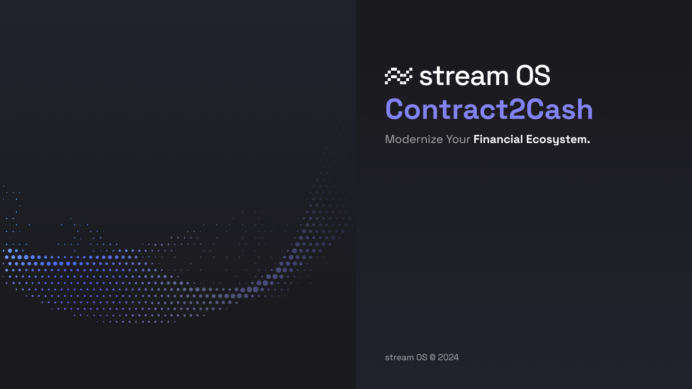

# Introduction

## Contract2Cash 

**streamOS:Contract2Cash** – Module enables companies to create, measure, bill and reconcile the entire contract 2 cash process for complex, small and large scale billing processes. 

From setting up complex contract structures, viewing usage and real-time charges – this document will walk you through our primary modules, interaction structures and how best to utilize the power of the financial operating system to best suit your needs. 

As always contact your streamOS sales representative or [email us](mailto:support@streamos.com) for any further question you may have.
 

