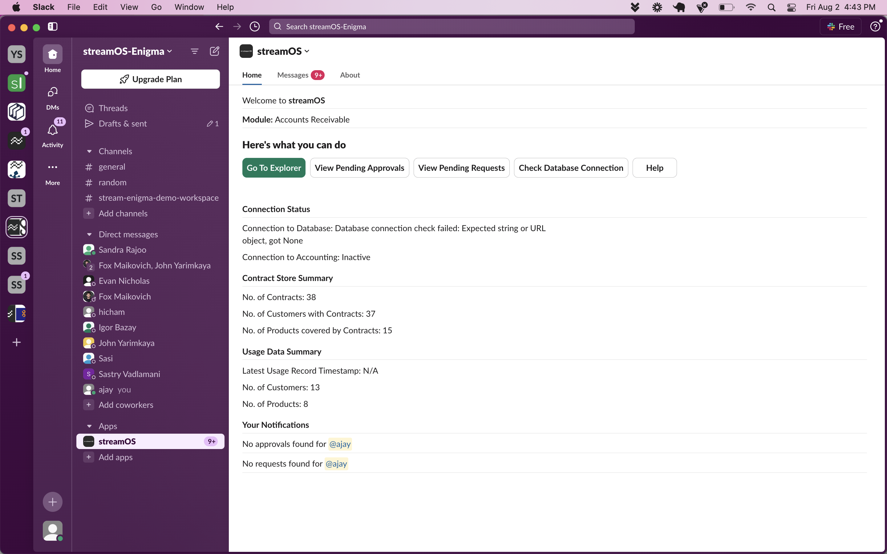
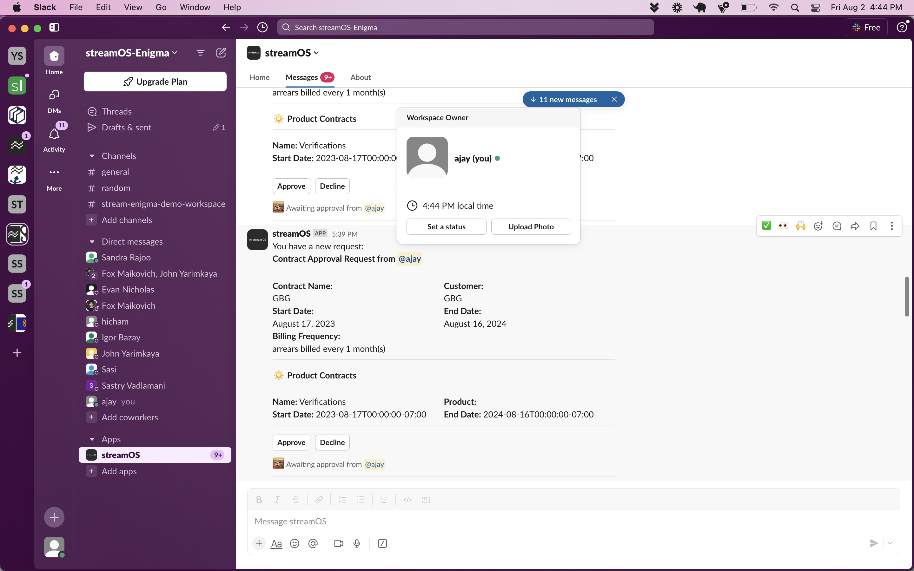
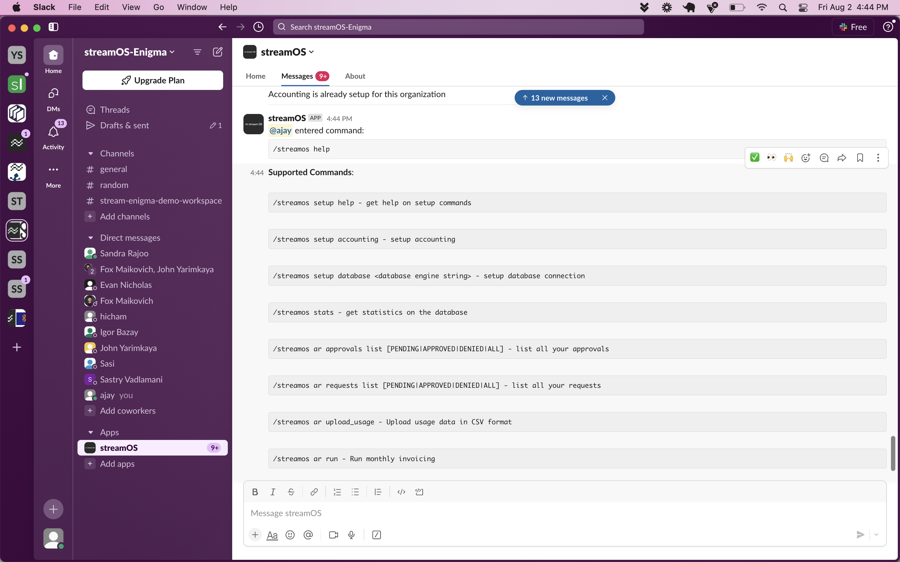

# The streamOS Bot

The streamOS Bot is the primary mode of communication between our platform and its users. You can find it in the App's section of your slack installation. 

Once you get there it is self explanatory 

There are 3 sections on the top of the page :

**Home::** This is your home base for streamOS where you receive summary of important information about our platform.  
    *Go to Explorer:* Click this to navigate to our web home



**Messages::** This is your direct message channel between you and the platform. 

The bot will send you notifications and requests on this channel. 



Type ```/streamos help``` to start interacting with the platform. 

