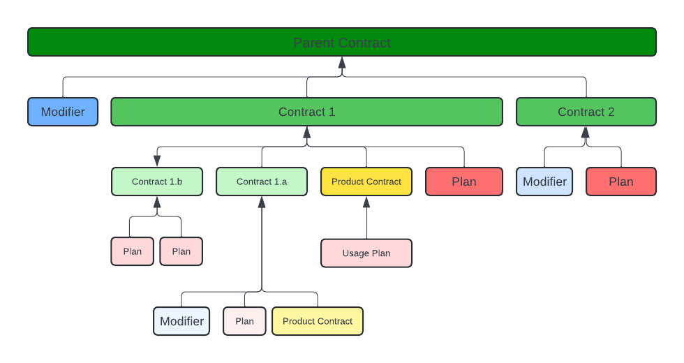

# Contracts

Contracts in streamOS are business logic elements that store financial logic of how to charge a customer. 

## Key Elements:
1. [Contract Types](#contract-types)
    - [Parent Contract](#parent-contract)
    - [Sub-Contract](#sub-contract)
    - [Product Contract](#product-contract)
2. Plans
    - [Fixed Fee Plans](#fixed-fee-plans)
    - [Usage Based Plans](#usage-based-plans)
3. Modifiers
    - [Minimums](#minimums)
    - [Discounts](#discounts)
    - [Credits](#credits)
4. Renewals
5. [Billing Frequency](#billing-frequency)
6. [Contract Examples](#contract-examples)

### Contract Types 
Contracts in streamOS are containers that decide how billing elements (plans / modifiers) are charged (frequency) and how they interact with each other. They define dates (start, end, how often) and sequence, they do not define how much (these are handled by plans and modifiers)



#### Parent Contract 

Parent Contracts are top level contracts that are directly linked with a customer. These are overarching concepts that are containers for all related elements and can action on all items below them. 
Any direct items associated with them are indicative of the fact that they will be charged just because the contract exists and for no other reason.

A Parent Contract contains the following elements:  

- **Display Name**: The Name of the Parent Contract - usually named something simple - 'Company A Master Agreement'
- **Customer ID**: The id of the customer associated with this contract 
- **Payment Terms**: in days - translated directly to the accounting platform as issue_date + days
- **Start Date**: The Start Date of the contract 
- **End Date**: The End Date of the contract 
- **Fixed Fees**: [List of FixedFee] : Any fixed fees associated with this contract 
- **Minimums**: [Minimum] Any minimums associated with this contract - (this will be applied after all charges are totaled)
- **Discounts**: [Discount] Any discounts that need to be applied after all the charges are totaled
- **Auto-Renewals**: [Auto-Renewal] Logic about renewal of the contract 
- **Sub-Contracts**: [List of [SubContract](#sub-contract)] Sub-Contracts associated with this parent
- **Billing Frequency**: [Billing-Frequency] Specifies how all aspects of charges in this contract should be billed

#### Sub-Contract 

Sub-Contracts are exactly like Parent Contracts except that they do not link to customer's and hence cannot live without a Parent Contract.  
They are useful concepts to separate units of billables by dates, billing frequencies or other behaviors.   
Sub-Contracts are infinitely nestable - meaning that a sub-contract can have infinite children, where each child is subject to the parent. 

**Example**

Company A has 2 kinds of fees it charges it customer's:  
a platform fee that is billed one year in advance for $10,000 & a support fee that is billed every month for $500. 

```
Parent Contract: 
    Sub-Contract: Platform Fee Contract 
        Fixed Fee Plan : Platform 
            Amount: $10,000 / year 
        Billing Frequency: 1Y advance
    Sub-Contract: Support Fee Contract
        Fixed Fee Plan : Support
            Amount: $500 / month
        Billing Frequency: 1M arrears
```

#### Product Contract

Product Contracts exist to create contract structures around products - they tie a product with its price and its usage. 

- **Display Name**: The name of the Contract  
- **Product ID**: The streamOS ID of the product that this contract is representing  
- **Tiers**: [Tiers](#usage-based-plans) the effective pricing schematic of the product   
- **Billing Frequency**: [Billing Frequency](#billing-frequency) how the charges from this contract need to be billed


### Plans

Plans are billable events in streamOS. They define amounts that need to be charged to the customer. They are operated upon by contracts to enforce how long and when. 
Plans are meant to be flexible, they can be created specific to each contract and applied or created as generic plans to be applied across your customer base.

#### Fixed Fee Plans

These are plans that have no variable component to them. Hence can be anything from a License Fee, Support Plan to a One Time Payment. 
Combined with contracts, they can be charged to the customer at different frequencies. 

- **Display Name**: The name of the plan (this can be customer specific such as - Customer XX One Time Payment or generic - Enterprise Customer Platform Fee)
- **Amount**/**period**: The amount of the fee per period (Ex. $100 / month)


#### Usage Based Plans

These are plans that are tied with usage of a product. Usage Based Plans are linked to products via Product Contracts. 

- **PricingType** :
    - FLAT : The single price irrespective of usage 
    - STEPPED: Charged the price at the target volume 
    - RAMPED: Charged the price through tiers for qualifying tiers

- **Tiers**:  | Min. Quantity | Max. Quantity | Rate |

- **Accumulation Period**: The duration of time over which usage needs to be totaled before the rate is calculated. 

Example:

| Min. Quantity | Max. Quantity | Rate |
|--------------|--------------|------|
| 0            | 100          | 100  |
| 101          | 200          | 90   |
| 201          | 300          | 80   |
| 301          | inf.         | 70   | 

**Scenario 1:** Quantity 500, STEPPED = 500 * 70 = $35000  
**Scenario 2:** Quantity 500, RAMPED = 100 * 100 + 100 * 90 + 100 * 80 + 200 * 70 = $41000

### Modifiers

Modifiers are called as such because they are called at the end of every contract run stage and affect the final output of a contract.Every modifier of a contract applies on the result of itself + all its sub-contracts and product contracts.

#### Minimums

This ensures that a minimum charge is billed to the customer irrespective of the amount billed by actual elements within the contract. Use minimums with contracts to specify period - per month / quarter / year / contract period.  
*Look at [Contract Examples](#contract-examples) for some creative ways.*

- **Display Name**: Name the minimum 
- **Amount**: The amount of the minimum

#### Discounts

Discount total billed to the customer. *Look at [Contract Examples](#contract-examples) for some creative ways.*

- **Display Name**: Name the minimum 
- **Percentage**: The percentage to be discounted
- **Threshold**: The number above which to apply the discount 

#### Credits

Credits to be provided to the customer per contract. 

- **Display Name**: Name 
- **Amount**: The amount credit to be applied
- **Expiry**: When the credit expires in days from creation


### Renewals

Renewals define behavior on contract expiry, it defines the period for which a contract is renewed and any rate increases. 

### Billing Frequency 

Billing Frequency defines how charges generated in a contract are billed out. All charges within streamOS are pro-rated on a per day basis in the system - they are then grouped and added based on the billing frequency to generate and total to be charged. 

streamOS supports generating billing on a per day, per week, per month or per year basis. With an appropriate use of contracts and billing frequencies contracts can be billed at any day and frequency. 

- **Type** : the offset to use to calculate the frequency  
           : CALENDAR: all offsets are based of a calendar start date  
           : CONTRACT: all offsets are based of a contract start date - of the associated contract 
- **Interval** : The number of periods 
- **Frequency** : 'D' for days, 'W' for weeks, 'M' for months, 'Y' for years (Interval:2 and Frequency: 'Y' = once every 2 years)
- **anchor** : Use the beginning or the end if each generated period
- **eq** : for periods with unequal days - equalize the amounts generated by them 

*Example(s):*

Contract :
```
**Start Date:** 2024-11-26
**End Date:** 2025-11-26

**Scenario 1:**
Type: CONTRACT 
Interval: 2 
Frequency: 'M'
anchor = 'S'

Interpretation: Bill all charges generated by this contract every *2 months* from the *contract start* at the *beginning* of each period

Dates Generated: 
    ['2024-11-26',
    '2025-01-26',
    '2025-03-26',
    '2025-05-26',
    '2025-07-26',
    '2025-09-26',
    '2025-11-26']

**Scenario 2**
Type: CALENDAR 
Interval: 2 
Frequency: 'M'
anchor = 'S'

Interpretation: Bill all charges generated by this contract every *2 months* from the *calendar start* at the *beginning* of each period

Dates Generated:
    ['2024-11-01', 
    '2025-01-01', 
    '2025-03-01', 
    '2025-05-01',
    '2025-07-01', 
    '2025-09-01', 
    '2025-11-01']

Notice the difference between the anchor dates - one anchors off the contract start and the other uses the closes calendar month of the contract. 

**Please note that billing frequencies of contracts influence those of the contracts below them**


## Contract Examples