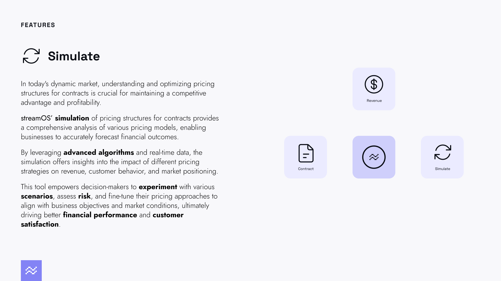

Simulations are currently available only for developer API users (Human users will have access to a user friendly version shortly, please stay up to date by following [streamOS](https://www.linkedin.com/company/stream-os/) for product updates)

1. **How simulations are setup ?**
2. **Running simulations**
3. **Viewing Results**

### How simluations are setup ? 

Simulation environments bootstrap with all contracts, customers and products from your production environment. 

The /sim [endpoints](https://api.streamos.io/swagger-ui/#/default) are simulation events and perform the same work as described in other sections except that they do not store data in production and are ephemeral (state recycles around system restarts etc.). Although our systems are largely up, state will be reset around system upgrades and catastrophical updates (like AWS going down)

### Running simulations 

Running simulations are almost exactly like working in a production environment except for a few changes - 

1. Usage: do not upload usage as you would regularly to your usage endpoint - instead structure your usage dataframe and pass it directly in to the /run endpoint as referenced [here](https://api.streamos.io/swagger-ui/#/default/post_sim_contracts__organization_id__factory_run) 

### Viewing Results 

Results of simulations are returned from [here](https://api.streamos.io/swagger-ui/#/default/get_sim_contracts__organization_id__factory_charges). 

This is a pandas.multiindex dataframe once unpacked - with column headers reflecting each level of the contract that produces results: 

**index:** datetime index of charges events 
**columns:**    [Parent Contract Info]
                [Sub Contract Info]  [total amount of parent]
                [Plan Info] [total amount of sub contract]
                [unit amount] [quantity] [total amount]

The way to process this information is to unwrap columns at each level and process the remaining dataframe to inspect details of how the prices were created.